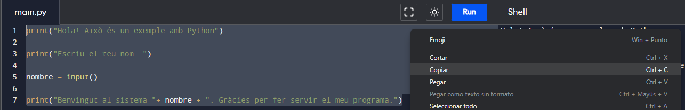
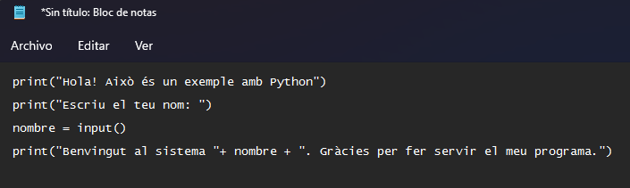
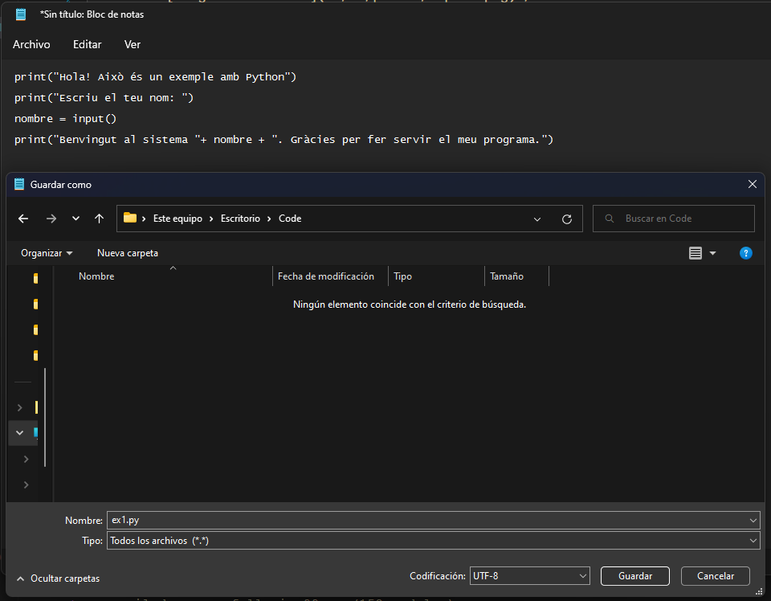
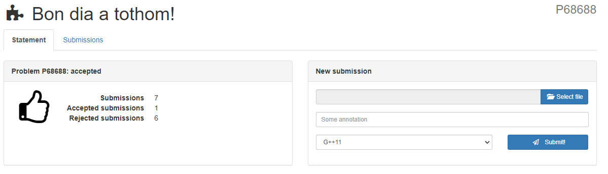

import Bleed from 'nextra-theme-docs/bleed'
import Callout from 'nextra-theme-docs/callout'

# Preguntes freqüents

## Com entregar el nostre codi al Jutge?

Per entregar el codi que hem desenvolupat al jutge, seguirem els següents passos:
1. Un cop tinguem el nostre codi acabat, el seleccionarem tot i ens el copiarem pressionant les tecles 'Ctrl+C':

  <Bleed></Bleed>

2. Llavors, obrirem un fitxer de text fent servir el 'Bloc de Notas' de Windows o algun programa d'edició de fitxers com NotePad++, Sublime Text o Visual Studio Code.

3. Un cop tinguem el fitxer obert, enganxarem el contingut.

  <Bleed></Bleed>

4. Seguidament, guardarem el fitxer que hem escrit en format Python (.py). Per fer-ho un cop seleccionada la carpeta de destí, escriurem a l'apartat *Nombre* el nom del fitxer i l'extensió .py i seleccionarem a *Tipo* l'opció de 'Todos los archivos'.

  <Bleed></Bleed>

5. Finalment ens dirigirem al jutge, seleccionam el fitxer que acabem de crear i premem el botó "Submit".

  <Bleed></Bleed>

6. Al acabar tots els jocs de prova, el jutge ens donarà el seu veredicte.

## Com instalar Python al nostre ordinador?
<Callout type="warning">
  Working on it...
</Callout>

## Com obtenir dos números separats per un espai amb Python?

Podeu veure el següent recurs que ho explica: [Taking space-separated integers user input in Python](https://bobbyhadz.com/blog/python-input-space-separated-integers)