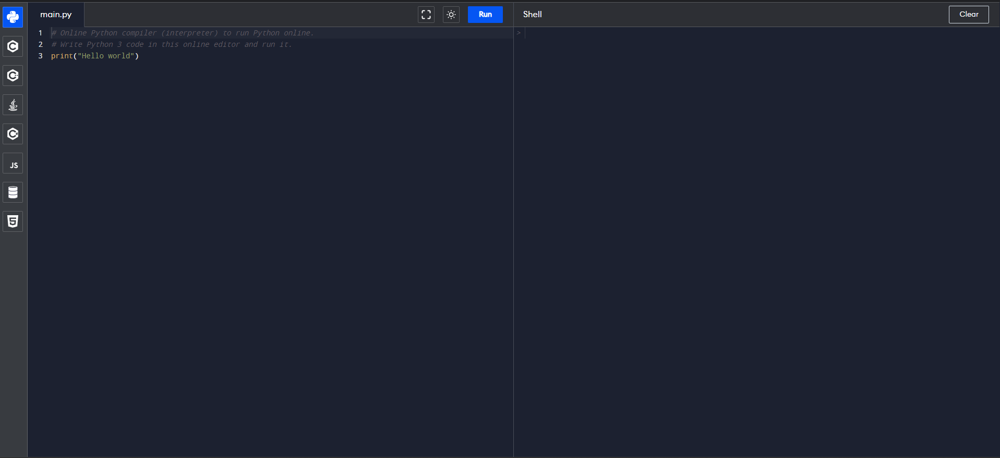
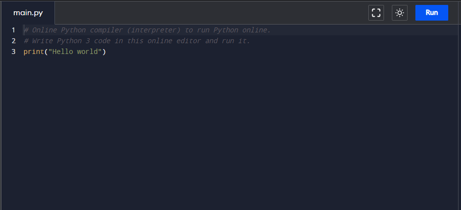
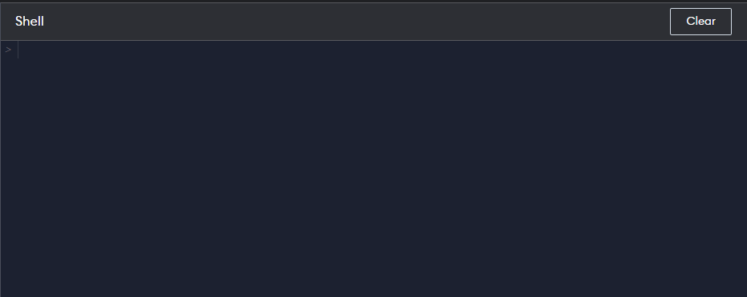
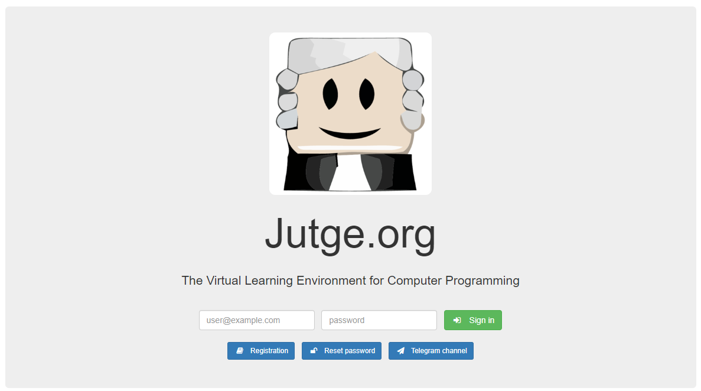
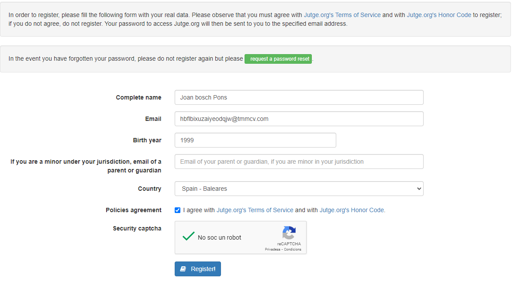
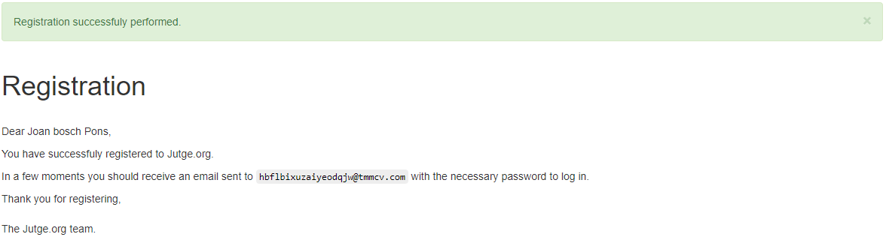
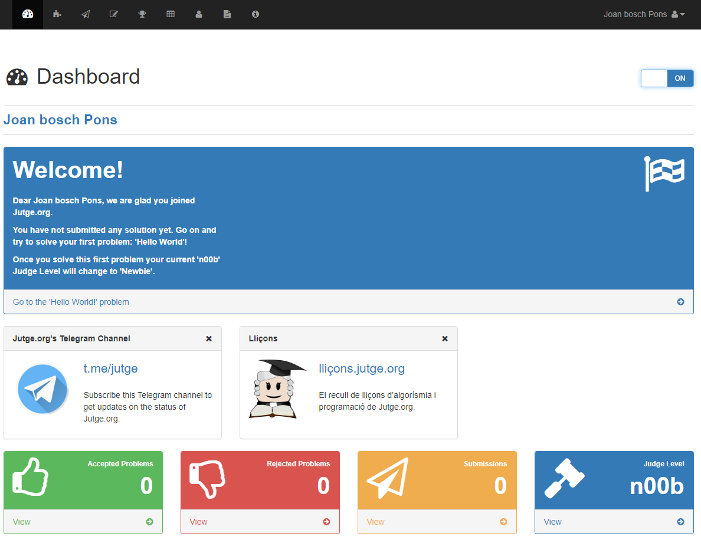
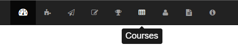
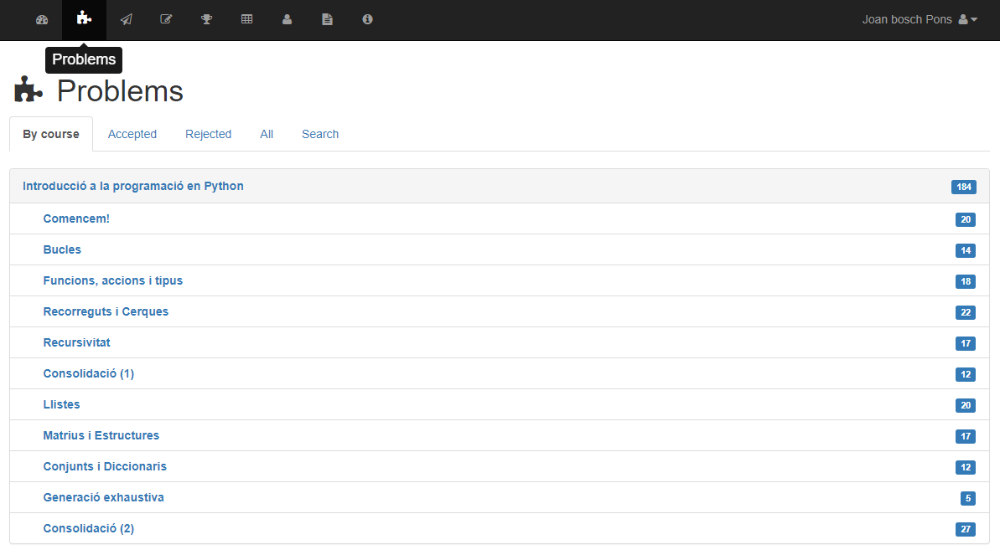
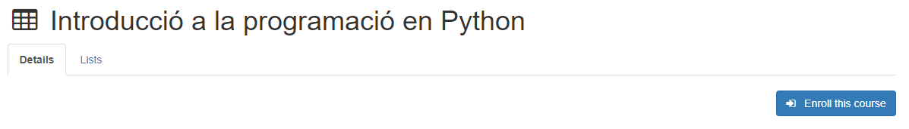

import Bleed from 'nextra-theme-docs/bleed'
import Callout from 'nextra-theme-docs/callout'

# Eines de desenvolupament

Per poder seguir el curs introductori a la programació amb Python, farem servir els següents recursos online:

## Compilador online

Per poder provar i executar el nostre codi de Python, farem servir un compilador online com [Programiz](https://www.programiz.com/python-programming/online-compiler/) que es troba al següent enllaç
[www.programiz.com/python-programming/online-compiler/](https://www.programiz.com/python-programming/online-compiler/).

La pàgina te el següent format:

  <Bleed></Bleed>

A l'esquerra del tot tenim el menu selector del llenguatge de programació que farem servir; **NO** cal tocar-ho ja que per defecte ve seleccionat Python.

A la banda esquerra també ens trobem amb l'editor. Aquí podrem escriure el nostre programa lliurement.

  <Bleed></Bleed>

Finalment, a la banda dreta ens trobem amb la consola. Aquí és on es produirán totes les interaccions amb el computador. Podrem veure, per exemple, els errors que es produeixin o el que pugui escriure el programa.

  <Bleed></Bleed>

## Jutge.org
Per altra banda, farem servir el [jutge.org](jutge.org) per posar a prova els nostres coneixaments. El Jutge és una eina desenvolupada per professors de la Facultat d'Informàtica de Barcelona, de la Universitat Politècnica de Catalunya on ens podem trobar multitud de problemes i reptes de programació.

Nosaltres el farem servir per comprovar si els programes que hem escrit són correctes o no.

### Crear un compte
El primer pas és crear un compte a la plataforma. 

1. Ens dirigim a [jutge.org](jutge.org)
2. Cliquem sobre el botó "Registration"

  <Bleed></Bleed>

3. Emplenem les dades requerides

  <Bleed></Bleed>

4. Llavors, ens trobarem amb el següent missatge de la pàgina web:

  <Bleed></Bleed>

5. Accedim al nostre correu electrònic i ens trobarem amb un email on ens proporcionaran les dades d'accés.
6. Un cop dins la plafaorma, ens trobarem amb una vista semblant a la següent. Si ho creiem necessari, podem accedir a l'apartat de configuració per canviar la nostra contrassenya.

  <Bleed></Bleed>

D'aquesta manera, ja tindrem el compte habilitat per poder començar a enviar solucions a problemes.

### Afegir-se al curs de Python

Un cop tinguem en compte del jutge, caldrà afegir-se al curs de Python de la plataforma.

1. Utilitzant el menú superior de navegació, accedirem a l'apartat 'Courses'.

  <Bleed></Bleed>

2. A l'apartat Courses, buscarem els cursos "Avaliable". Dins d'aquesta categoria, buscarem el curs anomenat *Introducció a la programació en Python*.

  <Bleed></Bleed>

3. Un cop dins del curs, clicarem sobre *Enroll this course* per accedir als problemes del mateix

  <Bleed></Bleed>

4. Finalment, accedint a l'apartat *Problems* a partir del menú principal, ens trobarem amb tots els problemes disponibles pel curs introductori a Python.

  <Bleed></Bleed>

