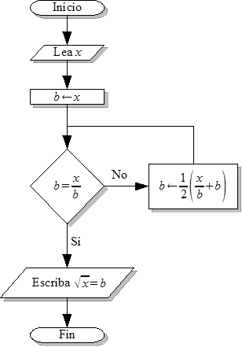

import Bleed from 'nextra-theme-docs/bleed'
import Callout from 'nextra-theme-docs/callout'

# Algorisme
<Callout emoji="">
  Un [algorisme](https://www.enciclopedia.cat/gran-enciclopedia-catalana/algorisme) és un conjunt finit i ordenat d'instruccions, símbols i regles o operacions que permet trobar la solució a un problema pas a pas o de forma recursiva.
  Els algorismes es poden especificar fent servir els diagrames de flux.
</Callout>

## Diagrames de flux
Un **diagrama de flux** és una representació visual de la interrelació entre les diferents parts d'un programa o algorisme i en el qual les interconnxions entre els blocs representen la seqüència d'instruccions.  

Per poder fer la representació gràfica, s'utilitzen els següents símbols:

  <Bleed></Bleed>

Al contrari del que es podria pensar, els algorismes formen part de la nostra vida cootidiana. A continuació es pot veure un exemple d'un algorisme per decidir si creuar o no el carrer:

  <Bleed></Bleed>

Ara bé, en aquest curs, ens centrarem amb l'ús matemátic dels algorismes. Podries dir quin és el propòsit del següent algorisme?

  <Bleed></Bleed>

