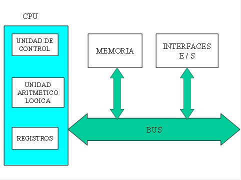
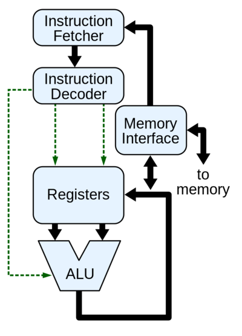

import Bleed from 'nextra-theme-docs/bleed'
import Callout from 'nextra-theme-docs/callout'

# Computadors
<Callout emoji="">
Un [computador](https://ca.wikipedia.org/wiki/Ordinador) (maquinari o ordinador) és una màquina electrònica programable capaç d'executar un conjunt de comandes predefinides.
Aquest conjunt de comandes és conegut com [programari](https://ca.wikipedia.org/wiki/Programari) (software).
</Callout>

Les parts principals d'un computador són les interfícies d'entrada i sortida, la unitat central de processament i la memòria.

  <Bleed></Bleed>

## Interfícies d'entrada i sortida

Les interfícies d'E/S són el conjunt de dispositius que permeten intercanviar informació entre el computador i l'exterior (sigui un usuari, màquina o dispositiu).

Algunes de les interfícies més conegudes són, per exemple, la pantalla, el teclat o el ratolí en el cas d'ordinadors portàtils i de sobretaula o la pantalla tàctil d'un telèfon mòbil.

## Unitat Central de Processament (CPU)

La CPU (per les seves sigles en anglès *Central Processing Unit*) és el component principal d'un computador. La seva principal funció és la d'interpretar i executar les instruccions mitjançant operacions aritmètiques o lògiques.

Internament esta compost pels següents elements:
1. Unitat aritmètic-lògica (ALU): Encarregada d'executar les operacions aritmètiques i lògiques.
2. Registres interns: Memòria interna del processador per poder obtenir les dades necessàries per executar les operacions i instruccions requerides.
3. Unitat de Control (UC): Encarregat de dirigir el tràfic i flux entre els registres i la ALU.

  <Bleed></Bleed>

## Memòria

La memòria d'un computador és la part encarregada d'emmagatzemar les dades que utilitza aquest per poder ser consultades.