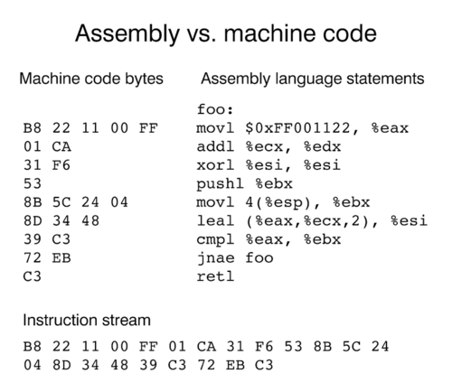

import Bleed from 'nextra-theme-docs/bleed'
import Callout from 'nextra-theme-docs/callout'

# Llenguatges de programació

<Callout emoji="">
  Un [llenguatge de programació](https://ca.wikipedia.org/wiki/Llenguatge_de_programaci%C3%B3) és un conjunt de normes i regles sintàctiques i semàntiques que cal seguir per escriure un programa informàtic.
  En funció del tipus de llenguatge de programació els podem classificar entre llenguatges d'alt nivell i llenguatges de baix nivell.
</Callout>

## Llenguatges d'alt nivell

Els [llenguatges d'alt nivell](https://ca.wikipedia.org/wiki/Llenguatge_de_programaci%C3%B3_d%27alt_nivell) són llenguatges on existeix un alt nivell d'abstracció respecte als detalls concrets del mateix maquinari.

Sovint, són llenguatges més fàcils d'utilitzar, ja que, d'alguna forma o altra, tenen semblances amb el llenguatge natural dels éssers humans.

Alguns exemples de llenguatges d'alt nivell són: C++, Python, Java, JavaScript, etc.

## Llenguatges de baix nivell

En contraposició, els [llenguatges de baix nivell](https://ca.wikipedia.org/wiki/Llenguatge_de_programaci%C3%B3_de_baix_nivell) són llenguatges on hi ha molt poca (o cap) abstracció respecte a l'arquitectura del processador.

Aquests tipus de llenguatges són usats pel desenvolupament de drivers o controladors.

Alguns exemples de llenguatges de baix nivell són: RISC-V, ARM, x86, etc.

  <Bleed></Bleed>

## Compilació

<Callout emoji="">
  La [compilació](https://www.termcat.cat/ca/cercaterm/fitxa/MjgwMTQ1NA%3D%3D) és el procés pel qual es tradueix un programa escrit en llenguatge d'alt nivell a un programa objecte que és escrit en llenguatge màquina, que és executable per l'ordinador.
</Callout>