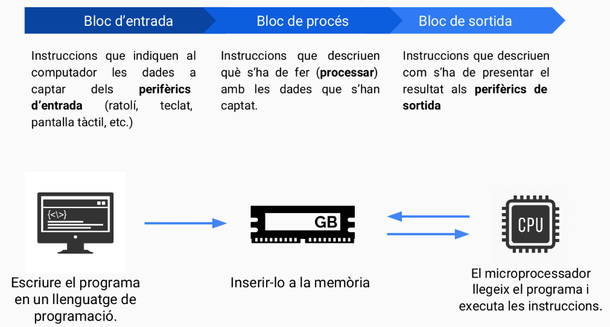

import Bleed from 'nextra-theme-docs/bleed'
import Callout from 'nextra-theme-docs/callout'

# Software

<Callout emoji="">
  El [software o programari](https://ca.wikipedia.org/wiki/Programari) és el conjunt dels programes informàtics, procediments i documentació que fan alguna tasca en un computador.
</Callout>

El fluxe d'execució d'un programa a sobre d'un computador es pot resumir en tres blocs o fases: bloc d'entrada, bloc de procés i bloc de sortida.

## El bloc d'entrada
El primer bloc a ser executat és el bloc d'entrada. Aquest defineix les instruccions necessàries per indicar al computador quines són les dades que s'han de captar dels **perifèrics d'entrada** (com ara el ratolí, teclat, pantalla tàctil, etc.). En alguns casos, es pot obviar l'execució d'aquest bloc.

## El bloc de procés
En segon lloc, ens trobem amb el bloc de procés. En aquest bloc es defineixes les instruccions que defineixen el comportament del programa. És a dir, es descriu què s'ha de fer (**processar**) amb les dades que s'han captat al bloc anterior.

## El bloc de sortida
Finalment, per acabar de tancar el procés d'execució del programa, es té en compte el bloc de sortida. Aquí es defineixen totes les instruccions les quals fan referència a com s'han de presentar els resultats obtinguts durant el bloc de procés utilitzant els **perifèrics de sortida** (com a pantalles, motors, interruptors, etc.)

<Bleed></Bleed>