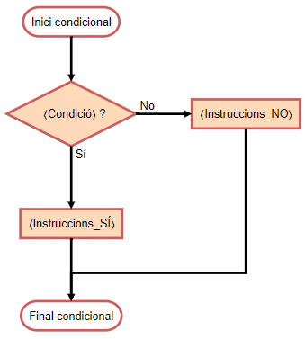
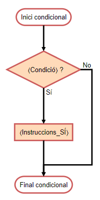
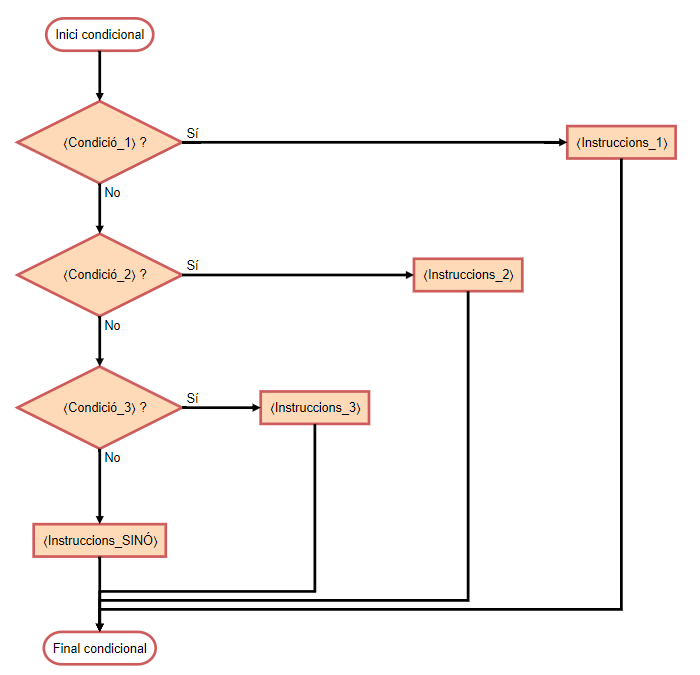

import Bleed from 'nextra-theme-docs/bleed'
import Callout from 'nextra-theme-docs/callout'

# Condicionals

<Callout emoji="">
Les estructures condicionals ens permetes executar una instrucció o una altra depenent d'una determinada condició. En Python la instrucció condicionals s'escriu usant les paraules clau `if` i `else` utilitzant el següent format:
</Callout>

```python
if ⟨Condició⟩:
    ⟨Instruccions_SÍ⟩
else:
    ⟨Instruccions_NO⟩
```
Llavors, el funcionament de les instruccions condicionals és senzill; si es compleix amb la ⟨Condició⟩, llavors passa a executar-se el bloc d'⟨Instruccions_SÍ⟩, altrament, s'executa el bloc d'⟨Instruccions_NO⟩. Per exemplificar el funcionament de l'estructura condicional, observem el següent diagrama de flux:

<div align="center">

  <Bleed></Bleed>
</div>

Cal tenir en compte que la part de l'`else` és una part opcional. En el cas de no proporcionar-se, senzillament no es farà res quan no es compleixi amb la condició. Llavors, el diagrama de flux d'aquest cas és el següent:

<div align="center">

  <Bleed></Bleed>
</div>

Un punt important de les estructures condicionals amb Python és que les ⟨Instruccions_SÍ⟩ i ⟨Instruccions_NO⟩ s'escriuen **identades** (és a dir, desplaçades cap a la part dreta de l'editor de codi). Aquesta és la forma que té el compilador per saber quan començen i quan acaben les instruccions d'un bloc i de l'altre.
Vegem ara un exemple:

```python
a = int(input())
b = int(input())

if a > b:
  print('El primer número és més gran.')
else:
  print('El segon número és més gran.')
```

Com podeu observar a l'exemple anterior, a la ⟨Condició⟩ hem de fer servir una expressió on el valor de retorn de la mateixa sigui o bé `true` o bé `false`. Com hem vist a l'apartat d'Operadors, això ho podem aconseguir mitjançant els **operadors relacionals** o els **operadors lògics**.

## Encadenació de condicionals

En alguns casos, ens podem trobar amb la casuística en que haurem d'encadenar algunes condicions. Això ho podem aconseguir afegint una nova estructura condicional dins d'un dels dos blocs d'instruccions ⟨Instruccions_SÍ⟩ i ⟨Instruccions_NO⟩ així com es pot observar al següent exemple.

```python
a = int(input())

if a > 0:
  print('El número és més gran que 0.')
else:
  if a < 0:
    print('El número és més petit que 0.')
  else:
    print('El número és igual a 0.')
```

Ara bé, sovint ens pot interessar fer servir l'expressió `elif` que ens serveix per encadenar condicions. Llavors, podriem encadenar tantes condicions `elif` com vulguessim.
```python
if ⟨Condició_1⟩:
    ⟨Instruccions_SÍ_1⟩
elif ⟨Condició_2⟩:
    ⟨Instruccions_SÍ_2⟩
...
elif ⟨Condició_N⟩:
    ⟨Instruccions_SÍ_N⟩
else:
    ⟨Instruccions_NO⟩
```

<div align="center">

  <Bleed></Bleed>
</div>

Per tant, el codi que hem vist abans, el podriem simplificar de la següent manera fent servir l'expressió `elif`:
```python
a = int(input())

if a > 0:
  print('El número és més gran que 0.')
elif a < 0:
  print('El número és més petit que 0.')
else:
  print('El número és igual a 0.')
```