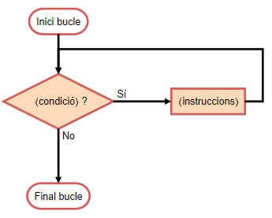

import Bleed from 'nextra-theme-docs/bleed'
import Callout from 'nextra-theme-docs/callout'

# While

<Callout emoji="">
Els bucles ens serveixen per poder repetir un número determinat de passos. En el cas del bucle `while` les instruccions dins del bloc `⟨instruccions⟩` s'executen mentres la `⟨condició⟩` sigui certa.
</Callout>

L'estructura que segueix una condició `while` en Python és la següent:

```python
while ⟨condició⟩:
    ⟨instruccions⟩
```

La `⟨condició⟩` que s'avalua, quasi sempre, serà fent servir operadors relacionals. Per altra banda a l'apartat `⟨instruccions⟩` s'hi pot executar qualssevol codi.

El diagrama de flux d'un bucle `while` és el següent:

<div align="center">

  <Bleed></Bleed>
</div>

## Exemple
Un ús molt comú del bucle while és per escriure `n` números. Vegem com seria el codi.

```python
n = int(input())
i = 0
while n > 0:
  print("Iteració núm: " + str(n))
  n = n - 1
print("S'ha acabat el bucle")
```
Per exemple, pel cas on `n=5` la sortida esperada és la següent:

```python
Iteració núm: 5
Iteració núm: 4
Iteració núm: 3
Iteració núm: 2
Iteració núm: 1
S'ha acabat el bucle
```